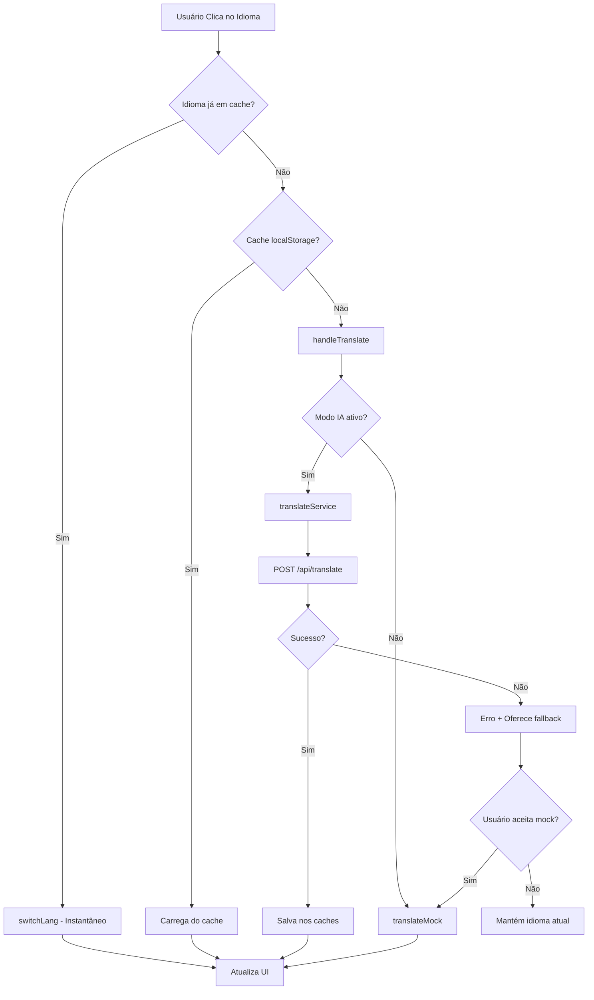

# 🏗️ Arquitetura do Sistema de Tradução

[⬅ Voltar ao Índice](README_INDEX.md)

## 📋 Visão Geral

Sistema modular e robusto para tradução de currículo com múltiplos idiomas, cache inteligente e fallbacks graceful. Após refatoração completa, o sistema foi simplificado de **6 arquivos duplicados** para **4 arquivos essenciais**.

## 🎯 Principios de Design

- **Single Responsibility** - Cada módulo tem uma responsabilidade específica
- **Type Safety** - TypeScript rigoroso em todas as interfaces
- **Graceful Degradation** - Fallbacks automáticos para falhas
- **Performance First** - Cache agressivo e otimizações
- **Developer Experience** - APIs simples e documentação clara

## 🔄 Fluxo Completo de Tradução



## 🧩 Módulos e Responsabilidades

### **Frontend Core**
```
useI18n (hooks/)
├── Estado global de tradução
├── Orquestração de cache/API
├── Loading states e error handling
└── Integração com localStorage
```

### **Service Layer**
```
translateService (lib/)
├── Interface para API de tradução
├── Tratamento de erros HTTP
├── Tipagem de requests/responses
└── Timeout e retry logic
```

### **Utilities**
```
languageUtils (utils/)          translationCache (utils/)
├── Normalização de códigos     ├── Cache persistente
├── Validação de idiomas        ├── Integridade de dados
├── Conversão API/interno       ├── Estatísticas de uso
└── Type guards                 └── Versionamento
```

### **Configuration**
```
languages (constants/)
├── Idiomas suportados
├── Metadados (nomes, flags)
├── Mapeamento para API
└── Configuração padrão
```

### **Fallbacks**
```
translateMock (lib/)            translateFree (lib/)
├── Dados estáticos mock        ├── LibreTranslate API
├── Simulação de delay          ├── Fallback gratuito
├── Zero dependency             ├── Rate limiting
└── Desenvolvimento             └── Produção emergencial
```

## 📊 Comparação: Antes vs Depois

### **Antes da Refatoração**
```
❌ 6 arquivos duplicados
❌ 3 funções translateWithAI diferentes
❌ Inconsistência pt-br/ptbr/pt
❌ localStorage sem SSR
❌ Lógica espalhada em hooks
❌ Tipos genéricos demais
❌ Cache sem validação
```

### **Depois da Refatoração**
```
✅ 4 arquivos essenciais
✅ 1 função translateWithAI unificada
✅ Códigos normalizados automaticamente
✅ SSR-safe com useLocalStorage
✅ Lógica centralizada em useI18n
✅ Tipos específicos e robustos
✅ Cache versionado e validado
```

## 🔧 Pontos de Extensão

### **Adicionando Novo Idioma**
1. `constants/languages.ts` → Adicionar idioma
2. `data/cv-{lang}.ts` → Criar dados mock
3. API backend → Verificar suporte
4. Testar fluxo completo

### **Novo Provedor de Tradução**
1. `lib/translate{Provider}.ts` → Implementar interface
2. `useI18n.ts` → Adicionar mode
3. Configurar env variables
4. Adicionar ao fallback chain

### **Otimizações de Cache**
1. `translationCache.ts` → Implementar TTL
2. Compression de dados grandes
3. IndexedDB para storage avançado
4. Background sync para updates

## 🛡️ Error Handling Strategy

### **Camadas de Fallback**
```
1. Tradução IA → 2. Cache Local → 3. Dados Mock → 4. Idioma Original
```

### **Recovery Mechanisms**
- **Network Errors** → Retry com exponential backoff
- **API Errors** → Fallback para mock ou free service
- **Cache Corruption** → Clear e rebuild automatico
- **Type Errors** → Graceful degradation com logs

## 📈 Performance Optimizations

### **Cache Strategy**
- **Memory cache** para sessão atual (O(1) access)
- **localStorage** para persistência entre sessões
- **Hash-based keys** para collision resistance
- **Versioned cache** para invalidação controlada

### **Network Optimization**
- **Single API endpoint** para simplicidade
- **Minimal payload** (apenas dados necessários)
- **Compression** via gzip automático
- **Connection pooling** via browser fetch

### **React Optimizations**
- **useCallback** em funções críticas
- **Selective re-renders** via dependency arrays
- **State batching** para updates múltiplos
- **Lazy loading** de dados traduzidos

## 🔍 Debugging e Monitoramento

### **Development Tools**
```typescript
// Hook debugging
const { status } = useI18n();
console.log('Translation stats:', status);

// Cache inspection
const stats = getCacheStats();
console.log('Cache size:', stats);

// Language validation
console.log('Valid:', isValidLanguage(input));
```

### **Production Monitoring**
- **Translation success rate** via status tracking
- **Cache hit ratio** para performance metrics
- **Error frequency** por tipo de fallback
- **Token usage** para cost control

## 🔮 Roadmap Futuro

### **Short Term**
- [ ] Background translation pre-loading
- [ ] Partial translation updates
- [ ] Better error messages UX
- [ ] Performance metrics dashboard

### **Medium Term**
- [ ] Offline translation support
- [ ] Translation diff/merge tools
- [ ] A/B testing for translation quality
- [ ] Auto-detection de idioma preferido

### **Long Term**
- [ ] Real-time collaborative translation
- [ ] AI-powered translation quality scoring
- [ ] Integration com translation memory systems
- [ ] Multi-model translation comparison
